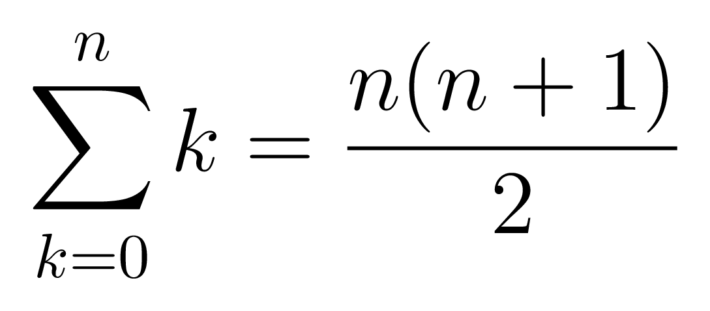

# Missing Number
## Énoncé 
Étant donné une liste d'entiers contenant tous les entiers compris entre `1`et `n` sauf un seul,
notre tâche est de retrouver l'entier manquant.

En entrée, le programme recevera :

- L'entier `n`.
- Une liste de `n - 1` entiers compris au sens large entre `1` et `n`.

## Solution
La solution que je propose utilise la somme des premiers entiers naturels :


Si on note `sn` la somme des `n` premiers naturels, et `s` la somme des éléments de la liste
d'entiers récupérée en entrée, qui sera calculée par la fonction ci-dessous, l'entier manquant sera toujours égal à `sn - s`.

**Fonction `somme`**:
```ocaml
let rec somme = function
    | [] -> 0
    | t::q -> t + somme q;;
```

## Résultats en console 
En se positionnant dans le dossier `cses-problemset/`, on exécute ce qui suit :
```shell script
$ ./run.sh missing_number
5
2
3
1
5
4
```
La dernière ligne représentant l'entier manquant.\
Des tests à plus grande échelle sont dans le fichier `outputs.txt`. Faire
```shell script
$ cat ~/cses-problemset/src/missing_number/outputs.txt
```