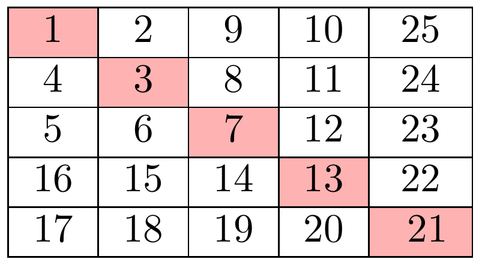

# Number Spiral
## Énoncé 
Une spirale d'entiers est une grille dont le carré 
situé tout en haut à gauche contient la valeur `1`. 
Voici les 25 premières cases de la spirale :


Notre tâche est de retrouver l'entier qui se trouve à la position `(y, x)` où `y` représente la ligne et `x` la colonne.

## Solution
Cette solution exploite un motif qui se répète pour tous les éléments de la diagonale :



En effet, on remarque :
 
- `3 - 1 = 2 = 2 * 1`
- `7 - 3 = 4 = 2 * 2`
- `13 - 7 = 6 = 2 * 3`
- `21 - 13 = 8 = 2 * 4`

Et on en déduit la relation de récurrence suivante :

Avec `a_1 = 1`. D'où, pour tout `n` dans `1,...,+\infty`, on a 

où `a_n` est l'élément `(n, n)` de la spirale. Ainsi, il est assez facile de retrouver l'élément à la position `(y, x)` à partir de `a_max(y ,x)`.


## Résultats en console 
En se positionnant dans le dossier `cses-problemset/`, on exécute ce qui suit :
```shell script
$ ./run.sh missing_number
1
5
5
25
```
La dernière ligne représentant l'élément à la position `(y, x)`.
