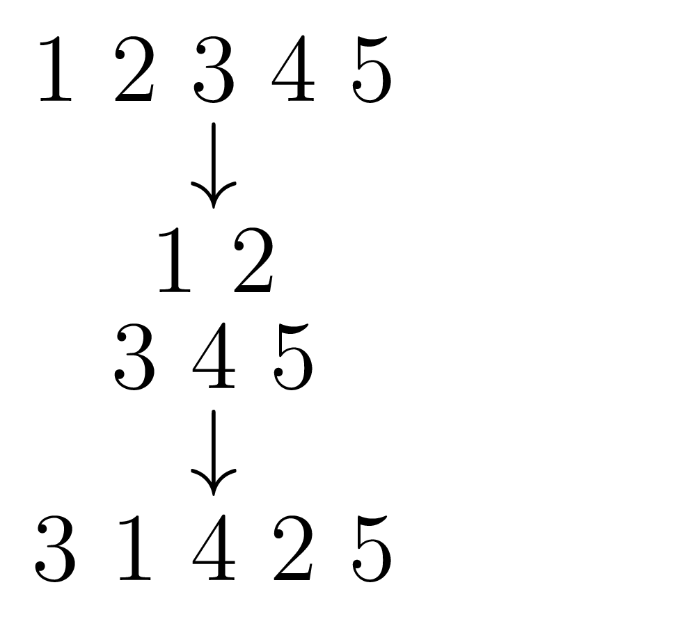

# Permutations
## Énoncé
Une permutation des entiers `1,...,n` est dite *belle* si dans celle-ci il n'existe pas deux entiers adjaçants tels que leur différence est égale à 1.

Notre tâche est, étant donné un entier `n`, de déterminer s'il existe une telle permutation des entiers `1,...,n`, d'en afficher une seule si c'est le cas, `"NO SOLUTION"` sinon.

## Solution
Il est clair que si `n=2,3`, il n'y a pas de solution. Dans ce cas, on affiche `"NO SOLUTION"`. Sinon,
il suffit de découper la liste des entiers en deux, et d'intercaler les éléments de la première moitié dans la seconde, en tenant compte des cas où `n` est impair.

**Exemple :** 


## Résultats en console 
En se positionnant dans le dossier `cses-problemset/`, on exécute ce qui suit :
```shell script
$ ./run.command permutations
3
NO SOLUTION
$ ./run.command permutations
5 
3 1 4 2 5
```
Des tests à plus grande échelle sont dans le fichier `outputs.txt`. Faire
```shell script
$ cat ~/cses-problemset/src/permutations/outputs.txt
``` 
